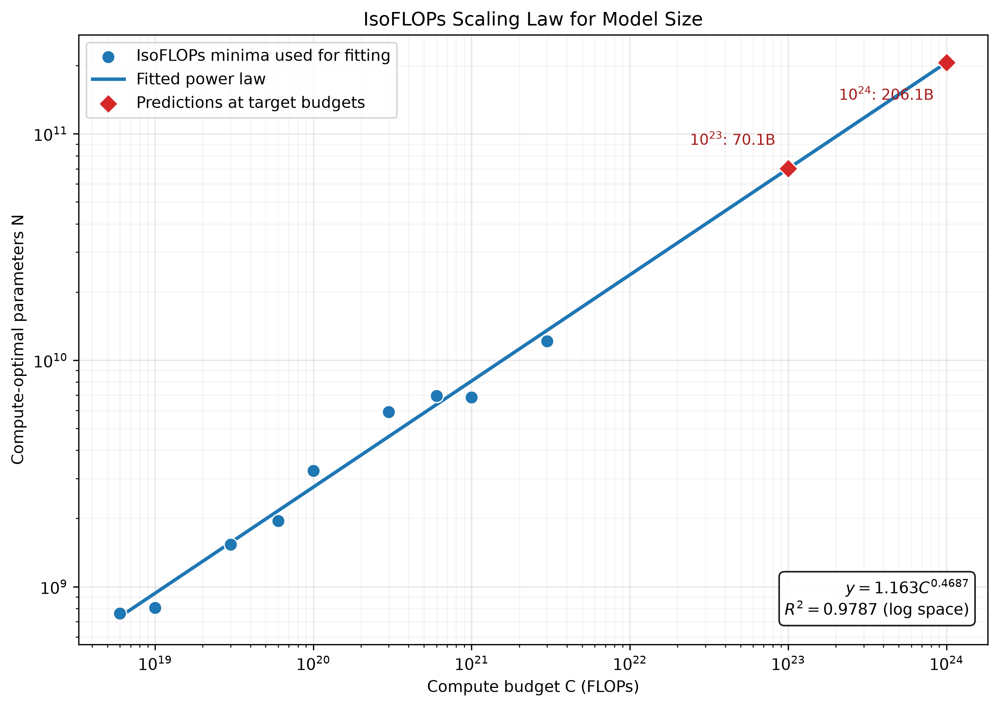
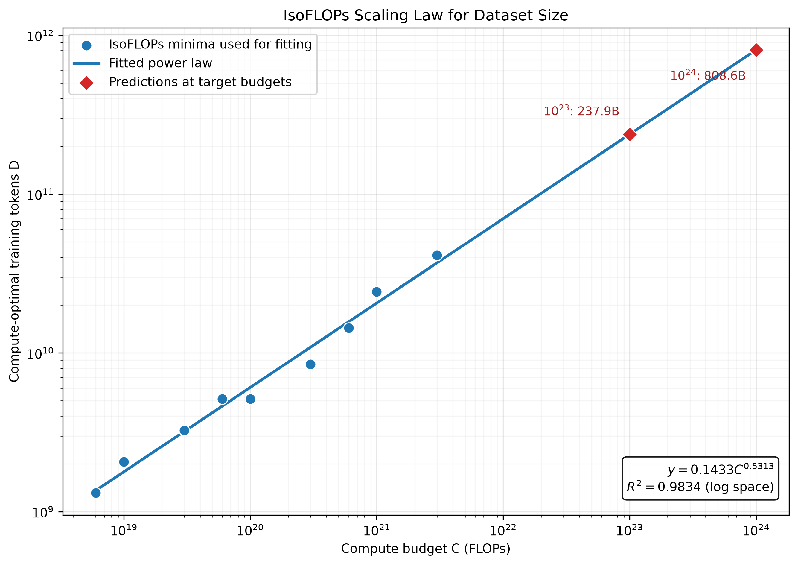

# 第二章：IsoFLOPs 缩放定律

## 方法

给定的 `data/isoflops_curves.json` 中共有 72 次训练运行，覆盖 9 个不同的计算预算。对于每一个固定的计算预算 $C_i$，我比较该预算下所有训练运行的最终训练损失，并选择最终训练损失最低的运行；该运行的模型参数量被记为计算最优模型规模 $N_{\mathrm{opt}}(C_i)$。

根据 Transformer 训练计算量的近似关系

$$
C \approx 6ND,
$$

该最优模型对应的计算最优训练数据量为

$$
D_{\mathrm{opt}}(C_i)=\frac{C_i}{6N_{\mathrm{opt}}(C_i)}.
$$

在获得 9 组 $\langle C_i,N_{\mathrm{opt}}(C_i)\rangle$ 和 $\langle C_i,D_{\mathrm{opt}}(C_i)\rangle$ 数据点后，我在以 10 为底的双对数空间中使用普通最小二乘法拟合幂律。具体来说，分别拟合

$$
\log_{10}N_{\mathrm{opt}}=a\log_{10}C+\log_{10}A
$$

和

$$
\log_{10}D_{\mathrm{opt}}=b\log_{10}C+\log_{10}B,
$$

从而得到 $N_{\mathrm{opt}}(C)=AC^a$ 和 $D_{\mathrm{opt}}(C)=BC^b$，并将拟合结果外推到 $10^{23}$ 和 $10^{24}$ FLOPs。

## （a）计算最优模型规模

拟合得到的模型规模缩放定律为

$$
N_{\mathrm{opt}}(C)=1.16341064\,C^{0.468682668}.
$$

该拟合在双对数空间中的决定系数为 $R^2=0.978704$，说明幂律能够较好地描述计算预算与最优模型规模之间的关系。下图中的蓝色圆点表示用于拟合的 9 个 IsoFLOPs 最优点，蓝线表示拟合出的幂律，红色菱形表示在两个目标计算预算下的外推结果。

**最终回答：**当计算预算分别为 $10^{23}$ 和 $10^{24}$ FLOPs 时，预测的计算最优模型规模分别约为 $7.005\times10^{10}$ 个参数和 $2.061\times10^{11}$ 个参数。

## （b）计算最优数据规模

拟合得到的数据规模缩放定律为

$$
D_{\mathrm{opt}}(C)=0.143256956\,C^{0.531317332}.
$$

该拟合在双对数空间中的决定系数为 $R^2=0.983351$，说明计算最优训练数据量同样与计算预算呈现出较明显的幂律关系。图中的蓝色圆点为根据 $D=C/(6N)$ 计算得到的最优训练 token 数，蓝线为幂律拟合结果，红色菱形为目标计算预算下的外推结果。

**最终回答：**当计算预算分别为 $10^{23}$ 和 $10^{24}$ FLOPs 时，预测的计算最优数据规模分别约为 $2.379\times10^{11}$ 个训练 token 和 $8.086\times10^{11}$ 个训练 token。
