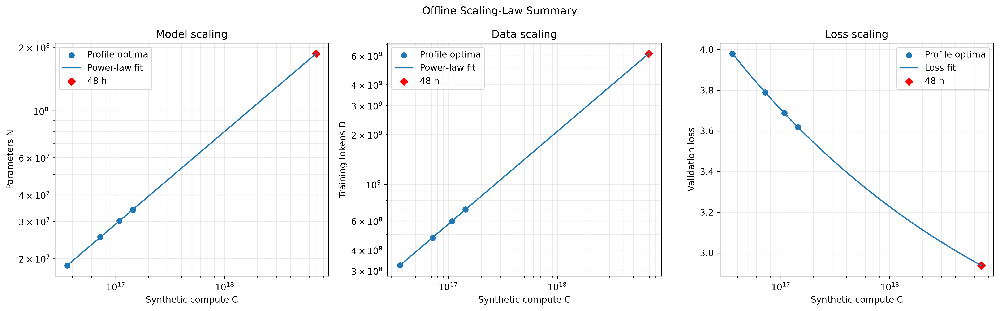

# 第三章：离线缩放定律实验

> 本章使用合成数据练习缩放定律方法，不是 Stanford API 的真实实验结果，也不能用于官方排行榜。

## 实验方法

我假设单卡的有效吞吐量为 $4\times10^{13}$ FLOPs/s，并使用

$$
C=6ND
$$

换算模型参数量、训练 token 数和计算预算。实验选择 0.25、0.5、0.75 和 1 小时四个预算，每个预算测试四种模型规模，因此模拟实验总用时为

$$
4\times(0.25+0.5+0.75+1)=10\text{ 小时},
$$

低于 12 小时限制，并保留 2 小时用于失败重试或补充实验。

对于每个预算，我用关于 $\log_{10}N$ 的二次函数拟合验证损失，取曲线最低点作为该预算下的 $N_{\mathrm{opt}}$，再由 $D_{\mathrm{opt}}=C/(6N_{\mathrm{opt}})$ 计算最优训练数据量。

## 缩放定律

对四组最优点进行双对数线性回归，得到

$$
N_{\mathrm{opt}}(C)=1.02025C^{0.438543},
\qquad R^2=0.999855,
$$

以及

$$
D_{\mathrm{opt}}(C)=0.163359C^{0.561457},
\qquad R^2=0.999912.
$$

两个指数之和为 1，与 $C=6ND$ 一致。为了预测验证损失，我另外拟合

$$
L_{\mathrm{opt}}(C)=E+KC^{-\gamma},
$$

该拟合的 $R^2$ 约为 1.000000。

## 48 小时预测

将缩放定律外推到 48 小时，连续预测为：

- 最优非 embedding 参数量：$1.865\times10^8$；
- 最优训练数据量：$6.177\times10^9$ tokens；
- 预测验证损失：$2.9385$。

根据 $N\approx12n_{\mathrm{layer}}d_{\mathrm{model}}^2$ 搜索合法的离散架构后，选择：

| 超参数 | 数值 |
|---|---:|
| 层数 | 17 |
| 隐藏维度 | 960 |
| attention head 数 | 15 |
| head dimension | 64 |
| intermediate size | 2560 |
| 非 embedding 参数量 | 188,006,400 |
| 训练 token 数 | 6,127,878,144 |

该离散架构与连续预测的参数量十分接近。需要注意，实验最大预算只有 1 小时，而目标预算为 48 小时，因此即使观测范围内的 $R^2$ 很高，长距离外推仍然存在较大不确定性。
